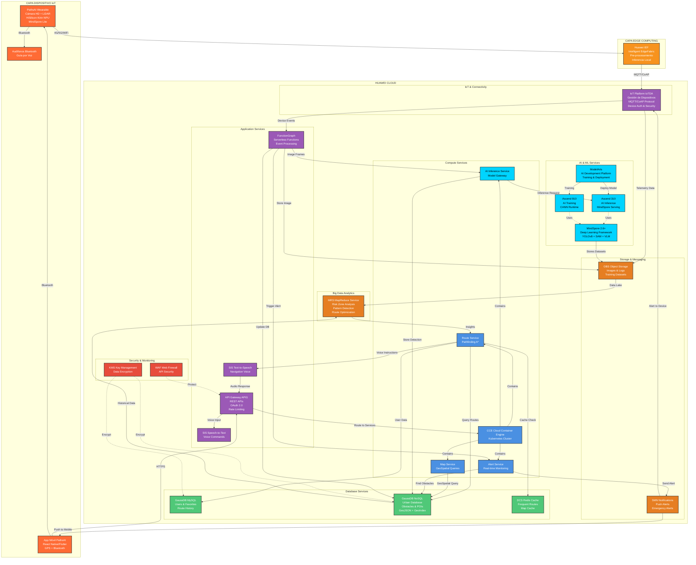
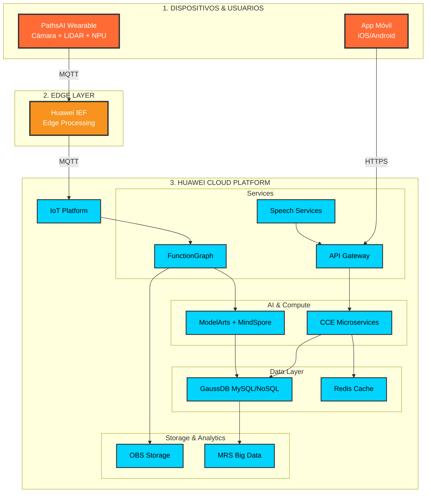
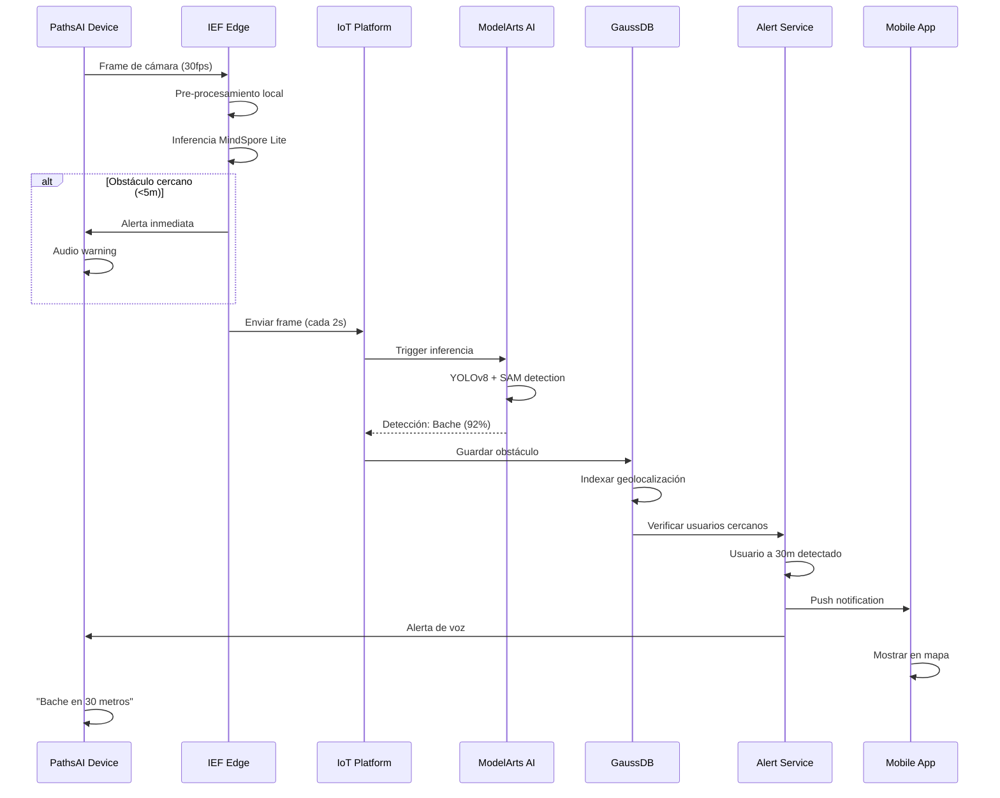
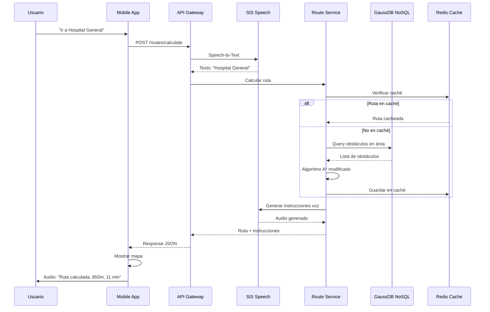
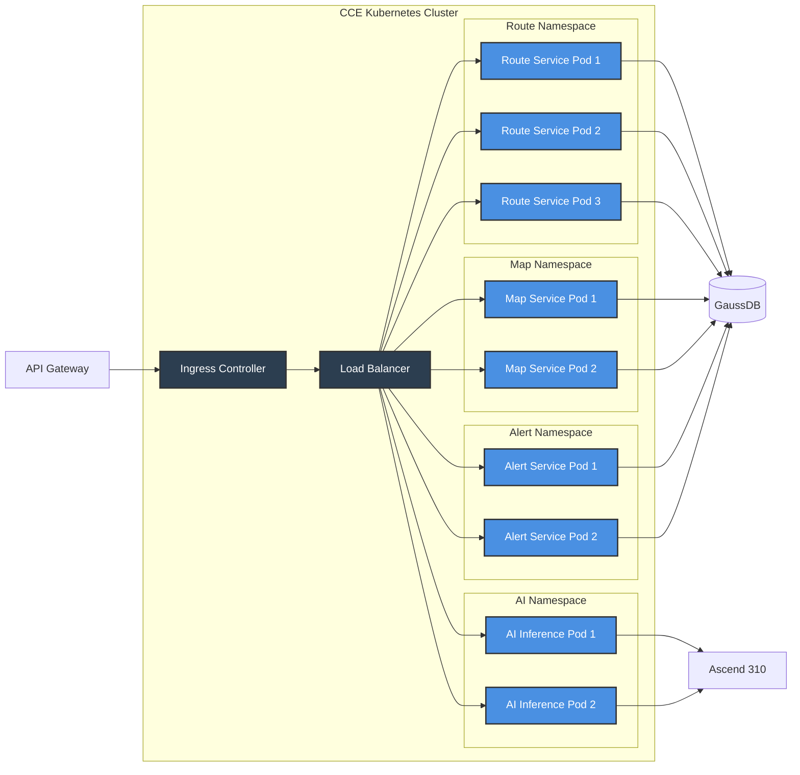
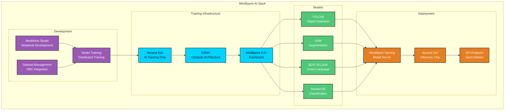
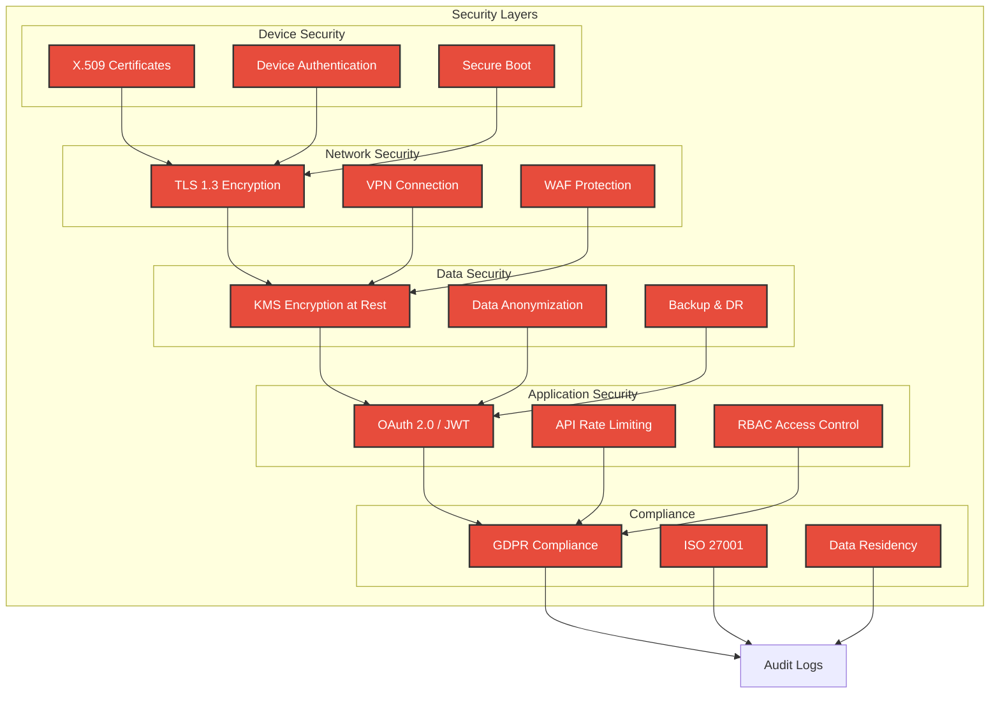

# Arquitectura PathsAI en Huawei Cloud - Diagrama Mermaid

## Diagrama Completo de Arquitectura



---

## Diagrama Simplificado por Capas



---

## Flujo de Datos - Detección de Obstáculos



---

## Flujo de Navegación - Ruta Segura



---

## Arquitectura de Microservicios en CCE



---

## Componentes de IA - MindSpore Stack



---

## Seguridad y Compliance



---

## Uso de Recursos

Para visualizar estos diagramas:

1. **En GitHub/Gitee**: Los archivos `.md` renderizarán automáticamente los diagramas Mermaid
2. **En VS Code**: Instalar extensión "Markdown Preview Mermaid Support"
3. **Online**: Copiar el código en https://mermaid.live
4. **En presentaciones**: Exportar como PNG/SVG desde Mermaid Live Editor

## Comandos útiles

```bash
# Instalar Mermaid CLI
npm install -g @mermaid-js/mermaid-cli

# Generar PNG desde archivo
mmdc -i arquitectura-mermaid.md -o arquitectura.png

# Generar SVG
mmdc -i arquitectura-mermaid.md -o arquitectura.svg
```
